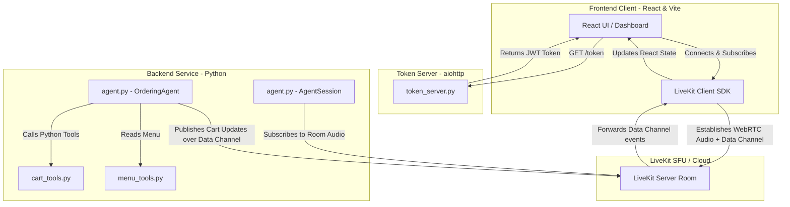

# LiveKit Voice Ordering Agent

A full-stack, real-time voice ordering system for a restaurant. Customers talk to **Ember**, an AI voice assistant, to browse the menu, build their cart, and confirm their order — all hands-free.

Built on [LiveKit Agents](https://docs.livekit.io/agents/), powered by **Mistral** (LLM), **Deepgram** (STT), and **Cartesia** (TTS).

---

## Architecture Overview



The frontend fetches a signed JWT from the **token server**, which also embeds an agent dispatch directive so LiveKit automatically assigns a Python worker to the new room. The agent handles all voice I/O and pushes cart state to the frontend in real time over a **data channel**.

---

## Features

- 🎙️ **Hands-free voice ordering** — speak naturally to place, modify, or cancel items
- 🛒 **Live cart sync** — cart updates instantly in the UI via LiveKit's reliable data channel
- 🧠 **LLM-powered** — Mistral `ministral-8b-latest` handles intent, tool calls, and conversation
- 📝 **Live transcription** — see what the agent heard in real time
- 🔇 **Mic toggle** — mute/unmute without losing the session
- 🍔 **Full menu tooling** — search, filter by allergen, browse combos, view item modifiers
- 🧾 **Order confirmation screen** — final receipt with a unique order ID
- 🔁 **Per-room cart isolation** — each browser session gets its own independent cart
- 🪟 **Context window management** — automatically truncates history when token usage exceeds 7 000 tokens

---

## Project Structure

```
livekit-ordering-agent/
├── Dockerfile                  # Container image for the backend
├── requirements.txt            # Python dependencies
│
├── backend/
│   ├── agent.py                # Voice agent entrypoint & session logic
│   ├── token_server.py         # aiohttp token server (GET /token)
│   ├── .env                    # Backend environment variables (not committed)
│   ├── context/
│   │   ├── system_prompt.txt   # Ember's personality & ordering rules
│   │   └── menu.json           # Restaurant menu data (injected at runtime)
│   └── tools/
│       ├── __init__.py         # Public tool exports
│       ├── cart_tools.py       # add/remove/modify/confirm cart operations
│       └── menu_tools.py       # search, filter, details, combos
│
└── frontend/
    ├── src/
    │   └── App.tsx             # Main React component (voice UI + cart panel)
    ├── index.html
    ├── package.json
    └── vite.config.ts
```

---

## Prerequisites

| Tool | Version |
|---|---|
| Python | ≥ 3.12 |
| Node.js | ≥ 18 |
| LiveKit Cloud account | [cloud.livekit.io](https://cloud.livekit.io) |
| Mistral API key | [console.mistral.ai](https://console.mistral.ai) |
| Deepgram API key | [console.deepgram.com](https://console.deepgram.com) |
| Cartesia API key | [play.cartesia.ai](https://play.cartesia.ai) |

---

## Setup

### 1. Clone the repo

```bash
git clone https://github.com/shayanizer8/livekit-ordering-agent.git
cd livekit-ordering-agent
```

### 2. Configure backend environment

Create `backend/.env` (copy the template below):

```env
# LiveKit
LIVEKIT_URL=wss://<your-project>.livekit.cloud
LIVEKIT_API_KEY=<your-api-key>
LIVEKIT_API_SECRET=<your-api-secret>

# LLM (Mistral)
MISTRAL_API_KEY=<your-mistral-key>

# Speech-to-text
DEEPGRAM_API_KEY=<your-deepgram-key>

# Text-to-speech
CARTESIA_API_KEY=<your-cartesia-key>

# CORS — set to your frontend origin
CORS_ORIGIN=http://localhost:5173
```

### 3. Configure frontend environment

Create `frontend/.env`:

```env
VITE_TOKEN_SERVER_URL=http://localhost:8080
```

---

## Running Locally

### Backend — Token Server

```bash
# Create and activate a virtual environment
python -m venv venv
venv\Scripts\activate        # Windows
# source venv/bin/activate   # macOS / Linux

pip install -r requirements.txt

python backend/token_server.py
# → Token server starting on http://0.0.0.0:8080
```

### Backend — Voice Agent Worker

In a **second terminal** (with the venv activated):

```bash
python backend/agent.py start
```

The agent registers itself with LiveKit Cloud and waits for rooms to be created.

### Frontend

```bash
cd frontend
npm install
npm run dev
# → http://localhost:5173
```

Open `http://localhost:5173` in your browser, grant microphone access, and start talking to Ember.

---

## Docker

Build and run the backend in a container:

```bash
docker build -t forge-flame-agent .
docker run --env-file backend/.env -p 8080:8080 forge-flame-agent
```

> **Note:** The Dockerfile runs `python agent.py start` by default. To run the token server instead, override the command:
> ```bash
> docker run --env-file backend/.env -p 8080:8080 forge-flame-agent \
>   python token_server.py
> ```

### Environment Variables (Docker / Production)

| Variable | Default | Description |
|---|---|---|
| `TOKEN_SERVER_HOST` | `0.0.0.0` | Host the token server binds to |
| `PORT` | `8080` | Port the token server listens on |
| `CORS_ORIGIN` | `http://localhost:5173` | Allowed frontend origin for CORS |
| `LIVEKIT_AGENT_NAME` | `forge-flame-agent` | Agent name registered with LiveKit |
| `CARTESIA_TTS_MODEL` | `sonic-3.5` | Cartesia TTS model ID |

---

## How It Works

### Session Flow

1. Browser loads → frontend calls `GET /token?room=ordering-room-<timestamp>`
2. Token server generates a signed JWT with an **agent dispatch directive** and returns `{ token, url }`
3. Frontend connects to LiveKit Cloud using the JWT
4. LiveKit automatically dispatches the Python agent worker to the room
5. Agent greets the guest: *"Welcome to Forge & Flame! I'm Ember…"*
6. Guest speaks → Deepgram STT → Mistral LLM → tool calls → Cartesia TTS plays back
7. On every cart mutation, agent publishes a `cart_update` JSON payload over the data channel
8. Frontend receives the payload and re-renders the cart panel in real time
9. Guest says *"confirm"* or clicks **Confirm order** → `confirm_order` tool finalises the cart → agent disconnects after farewell

### Agent Tools

| Tool | Description |
|---|---|
| `add_item_to_cart` | Add a menu item with optional size & modifiers |
| `remove_item_from_cart` | Remove a specific item from the cart |
| `modify_item_in_cart` | Change modifiers or size of an existing cart item |
| `add_combo_to_cart` | Add a combo meal with burger choice and upgrades |
| `get_cart_summary` | Fetch live cart state (always called before modifications) |
| `confirm_order` | Finalise the order and trigger room disconnect |
| `search_menu` | Full-text search across all menu items |
| `get_item_details` | Full details for a single menu item |
| `get_category_items` | All items in a given category |
| `get_combo_details` | Details for a specific combo |
| `get_all_combos` | Summary of all available combos |
| `filter_menu_by_allergen` | Items safe for a given allergen |
| `get_item_modifiers` | Available customisation options for an item |

---

## Tech Stack

| Layer | Technology |
|---|---|
| Voice agent framework | [LiveKit Agents](https://docs.livekit.io/agents/) ≥ 1.2 |
| LLM | Mistral `ministral-8b-latest` (OpenAI-compatible API) |
| Speech-to-text | Deepgram `nova-2` |
| Text-to-speech | Cartesia `sonic-3.5` |
| VAD | Silero (via LiveKit inference) |
| Token server | Python + aiohttp |
| Frontend | React 18 + TypeScript + Vite |
| Real-time transport | LiveKit Cloud (WebRTC) |

---

## License

MIT